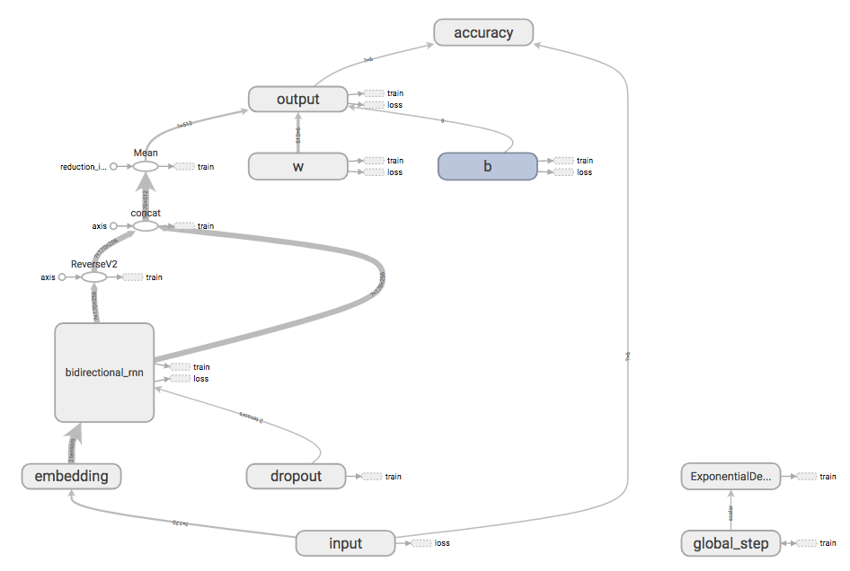

# ToxicCommentChallenge
## Identify and classify toxic online comments
Text classification using GloVe embeddings, CNN and stacked bi-directional LSTM with Max K Pooling.  
Using dataset from Kaggle's [Jigsaw Toxic Comment Challenge](https://www.kaggle.com/c/jigsaw-toxic-comment-classification-challenge)  

## Introduction
A flurry of content is produced on a daily basis throughout the Internet, on social media sites, blogs, news websites etc from the online interaction be- tween users. While this situation contributes signif- icantly to the quality of human life, unfortunately it involves enormous dangers, since online texts with high toxicity can cause personal attacks, online ha- rassment and bullying behaviors Discussing things you care about can be difficult.   
  
Labeling is a crucial task that has several applications including targeting ”trolls” on forums, preventing bullying on social networks or selecting the most ac- curate comments on a recommendation engine. Au- tomatic abusive language detection is a difficult but important task for online social media. Fighting abu- sive language online is becoming more and more im- portant in a world where social media plays a sig- nificant role in shaping peoples minds (Perse and Lambe, 2016). 
  
Warner and Hirschberg (2012) and Burnap and Williams (2015) are one of the early researches to use machine learning based classifiers for detect- ing abusive language. Djuric et al., (2015) incor- porated representation word embeddings (Mikolov
et al., 2013). Nobata et al. (2016) combined pre- defined language elements and word embedding to train a regression model. Waseem (2016) used logis- tic regression with n-grams and user-specific features such as gender and location. Davidson et al. (2017) conducted a deeper investigation on different types of abusive language. Badjatiya et al. (2017) exper- imented with deep learning-based models using en- semble gradient boost classifiers to perform multi- class classification on sexist and racist language. All approaches have been on one step.  


## Purpose
The purpose of this project is to build models that best classifies the comments into the following categories: toxic, severe\_toxic, obscene, threat, insult, identify\_hate. 

## Motivation
Traditionally Recurrent Neural Networks are best known to work with text data and Convolutional Neural Networks with image processing.  Recently, Convolutional Neural Networks (CNN) are being applied to text classification or natural language processing both to distributed as to discrete embedding of words [1], without using syntactic or semantic knowledge of a language [3].  Also, a recurrent CNN model was proposed recently for text classification without human-designed features [2] by succeeding to outperform both the CNN model as well as other well-established classifiers.

## Dataset 
Data for this project are a large number of Wikipedia comments that is part of the Kaggle dataset. 

## Word Embeddings
A word embedding is an approach to provide a dense vector representation of words that capture something about their meaning. It turns text into numbers and  helps building a low-dimensional vector representation from corpus of text, which preserves the contextual similarity of words.

Word embeddings are an improvement over simpler bag-of-word model word encoding schemes like word counts and frequencies that result in large and sparse vectors (mostly 0 values) that describe documents but not the meaning of the words.

Word embeddings work by using an algorithm to train a set of fixed-length dense and continuous-valued vectors based on a large corpus of text. Each word is represented by a point in the embedding space and these points are learned and moved around based on the words that surround the target word.

It is defining a word by the company that it keeps that allows the word embedding to learn something about the meaning of words. The vector space representation of the words provides a projection where words with similar meanings are locally clustered within the space.

The use of word embeddings over other text representations is one of the key methods that has led to breakthrough performance with deep neural networks on problems like machine translation.   

For this project I used the **Stanford GloVe embeddings** downloaded from :  
**Common Crawl (840B tokens, 2.2M vocab, cased, 300d vectors, 2.03 GB download): glove.840B.300d.zip**  

## Models
I have implemented 3 different models here using Python 2.7, Tensorflow 1.4, SciPy, Numpy.  Accuracy from the models are shown below along with the network Architecture. 
Additionally I have also added a simple BiDirectional LSTM keras Model which gives similar accuracy.  

### Logistic Regression 
```python
CV score for class toxic is -0.141080425752
CV score for class severe_toxic is -0.0297990227241
CV score for class obscene is -0.0804189464205
CV score for class threat is -0.0151034029795
CV score for class insult is -0.0895439792452
CV score for class identity_hate is -0.0330330762226
Total CV score is -0.0648298088908
```

### Convolutional Neural Network Model 
Implemented [Convolutional Neural Networks for Sentence Classification](http://www.aclweb.org/anthology/D14-1181)  

**Model Graph**  
  
  
**Accuracy**
```
Epoch:0 Train Loss: 0.09688197537347747, Train Accuracy: 0.9730627584610475
Epoch:1 Train Loss: 0.044754850838100164, Train Accuracy: 0.9829976767253723
Epoch:2 Train Loss: 0.03855618966644687, Train Accuracy: 0.9851702522504387
Epoch:3 Train Loss: 0.033110798796994634, Train Accuracy: 0.9871704034016947
Epoch:4 Train Loss: 0.028340381063389358, Train Accuracy: 0.9890294774386129
Epoch:5 Train Loss: 0.024460958881994312, Train Accuracy: 0.9905478791670087
Epoch:6 Train Loss: 0.021070652476917015, Train Accuracy: 0.9917235158228377
Epoch:7 Train Loss: 0.017409704199560096, Train Accuracy: 0.9932398256482512
Epoch:8 Train Loss: 0.01427258154710704, Train Accuracy: 0.9945575834086007
Epoch:9 Train Loss: 0.011801619254976487, Train Accuracy: 0.9955179481789541
Epoch:10 Train Loss: 0.010111599421370805, Train Accuracy: 0.996273490628691
Epoch:11 Train Loss: 0.0083960513797339, Train Accuracy: 0.9969997744690358
Epoch:12 Train Loss: 0.007301356534590948, Train Accuracy: 0.997391653003509
Epoch:13 Train Loss: 0.006378908369844902, Train Accuracy: 0.997729192002053
Epoch:14 Train Loss: 0.005798593860440611, Train Accuracy: 0.9979789488579641
Epoch:15 Train Loss: 0.005340096975951777, Train Accuracy: 0.9982130310317295
Epoch:16 Train Loss: 0.004625524440042175, Train Accuracy: 0.9984241220771214
Epoch:17 Train Loss: 0.00429624308009608, Train Accuracy: 0.998547434041435
Epoch:18 Train Loss: 0.0038189950454832512, Train Accuracy: 0.9987282212434956
Epoch:19 Train Loss: 0.003519605719197555, Train Accuracy: 0.9988295854955768
Epoch:20 Train Loss: 0.003352333339784744, Train Accuracy: 0.9989319963210276
Epoch:21 Train Loss: 0.003245662289891537, Train Accuracy: 0.9989090067234315
Epoch:22 Train Loss: 0.0029979815607246558, Train Accuracy: 0.9989737982160589
Epoch:23 Train Loss: 0.0029260244573758734, Train Accuracy: 0.9990312729754379
Epoch:24 Train Loss: 0.002874837110806529, Train Accuracy: 0.9990250022415174
Training complete
Predictions complete
```
  
### BiDirectional LSTM
Recurrent neural networks (RNN) are networks with loops in them, allowing the persistence of infor- mation. A recurrent neural network can be thought of as multiple copies of the same network, each passing a message to a successor. Long Short Term Memory networks, called LSTMs are a special kind of RNN, capable of learning long-term dependencies. All re- current neural networks have the form of a chain of repeating modules of neural network. In standard RNNs, this repeating module will have a very simple structure, such as a single tanh layer.  
  
One appeal for RNNs is that they might be able to connect previous information to the present task, such as previous sentences might help the under- standing of the following sentences. Yet, in reality, it depends. As data length grows, RNNs become unable to learn how to connect information. And this is exactly where Long Short Term Memory neural networks (LSTMs) come on stage. They are ex- plicitly designed to avoid the long-term dependency problem. The code idea behind LSTMs is the cell state, which is more-or-less like a conveyor belt. It goes from end to end of the entire chain, with only some minor linear interactions. Hence, it is very easy for information to just flow along it without being changed.  
  
The principle of BiDirectional Recurrent Neural Network (BRNN) is to split the neurons of a regular RNN into two directions, one for positive time direc- tion (forward states), and another for negative time direction (backward states). Those two states output are not connected to inputs of the opposite direction states.  
states.  
  
Here I have used a stacked Bidirectional LSTM with max k-pooling (a fully connected feed forward net- work). The network here has 500 hidden units in the forward and backward LSTM layers. The output of the pooling layer concatenate to a fully-connected layer, while the softmax function is applied on fi- nal layer (which would force the 6 probabilities to add up to 1) with 6 units, which correspond to the predicted probabilities of each of the 6 labels.  


**Model Graph**


**Accuracy**
```
step:24000 Train Loss: 1.3490717, Train Accuracy: 0.9575
step:24100 Train Loss: 1.1947979, Train Accuracy: 0.9609375
step:24200 Train Loss: 1.4230306, Train Accuracy: 0.984375
step:24300 Train Loss: 1.5326409, Train Accuracy: 0.973125
step:24400 Train Loss: 1.3895309, Train Accuracy: 0.9765625
step:24500 Train Loss: 1.2192655, Train Accuracy: 0.96875
step:24600 Train Loss: 1.3316984, Train Accuracy: 0.9765625
step:24700 Train Loss: 1.4945354, Train Accuracy: 0.9775
step:24800 Train Loss: 1.2704673, Train Accuracy: 0.9765625
step:24900 Train Loss: 1.2523654, Train Accuracy: 0.97875
Training complete
Predictions complete
```

### Conclusion
As shown CNN can outperform well established methodologies providing enough evidence that their use is appropriate for toxic comment classification. The promising results are motivating for further development of CNN based methodologies for text mining in the near future, in our interest, employing methods for adaptive learning and providing further comparisons with n-gram based approaches.  

While a complex BRNN model produced very similar results it can be clearly seen that CNN can be used to produce similar results without the additional disadvantages with RNN's for eg. increased training time.   

Additionally the accuracy can be further increased by techniques such as data augmentation and additionally cleaning the input data and normalizing the text.

### References
[Convolutional Neural Networks for Sentence Classification](http://www.aclweb.org/anthology/D14-1181)  
[LSTM by example using Tensorflow](https://towardsdatascience.com/lstm-by-example-using-tensorflow-feb0c1968537)  
